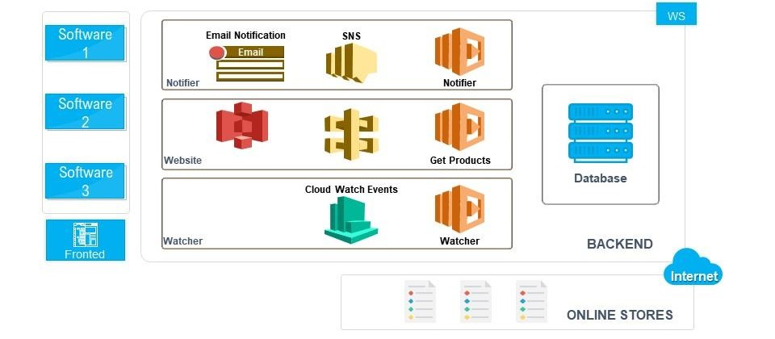
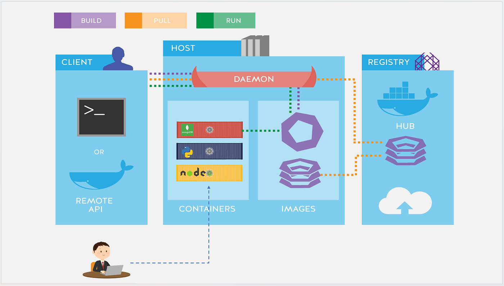
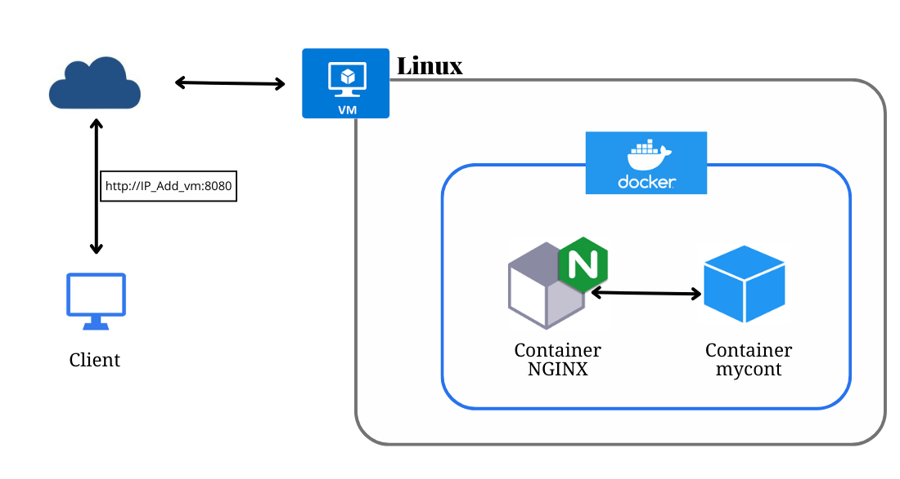
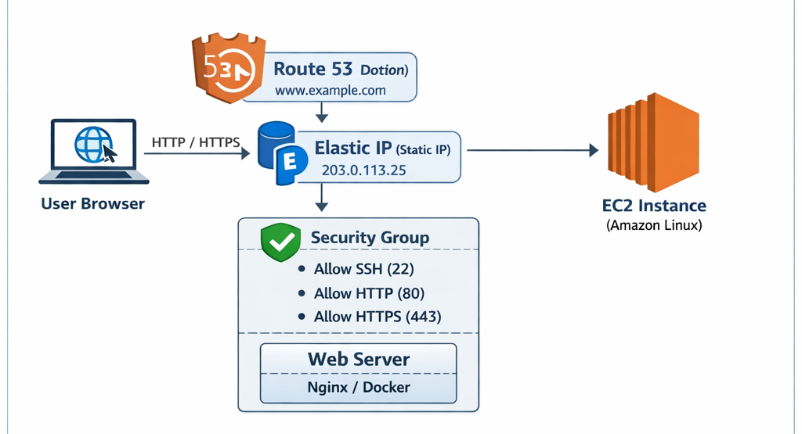
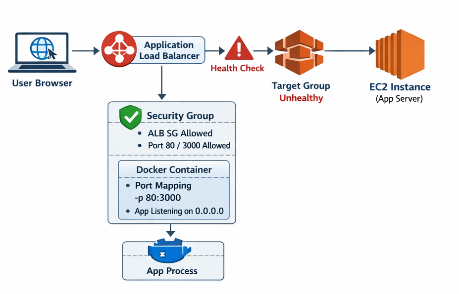

# AWS Server Management Assignment — Combined README (Tasks 1–7)

This repository contains **all 7 tasks** in one bounded `README.md` file, including **screenshots** (stored under the `images/` folder).

---

## Table of Contents
1. [Task 1 — Simple Full Stack Application (Frontend + Backend + MySQL)](#task-1--simple-full-stack-application-frontend--backend--mysql)
2. [Task 2 — Docker Deployment on AWS EC2 (Amazon Linux)](#task-2--docker-deployment-on-aws-ec2-amazon-linux)
3. [Task 3 — AWS EC2 Deployment using Docker (Nginx)](#task-3--aws-ec2-deployment-using-docker-nginx)
4. [Task 4 — Application Access (Public IP / Elastic IP / Route 53)](#task-4--application-access-public-ip--elastic-ip--route-53)
5. [Task 5 — Load Balancer & Auto Scaling (ALB + ASG)](#task-5--load-balancer--auto-scaling-alb--asg)
6. [Task 6 — Cost Optimization (Free-tier + Minimal + Auto Scaling)](#task-6--cost-optimization-free-tier--minimal--auto-scaling)

---
## Docker Workflow (Container Lifecycle) – Explanation

This diagram represents the **Docker Container Lifecycle State Machine**, which explains how a Docker container moves between different states based on Docker commands and runtime events.

### Container States
- **created** – Container is created but not started.
- **running** – Container is actively executing.
- **paused** – Container execution is temporarily frozen.
- **stopped** – Container has exited normally.
- **deleted** – Container is removed from the system.
- **die** – Container process has exited.
- **oom** – Container is killed due to Out Of Memory.

### Key Docker Commands and Transitions
- `docker run` → Creates and starts a container (`created → running`)
- `docker stop` → Gracefully stops a container (`running → stopped`)
- `docker kill` → Forcefully stops a container (`running → die`)
- `docker start` → Starts a stopped container (`stopped → running`)
- `docker restart` → Stops and starts again (`running → die → running`)
- `docker pause` → Freezes container execution (`running → paused`)
- `docker unpause` → Resumes execution (`paused → running`)
- `docker rm` → Removes a stopped container (`stopped → deleted`)

### Restart Policy
- If a container exits unexpectedly (`die` or `oom`), Docker checks the **restart policy**.
- If enabled, the container is automatically restarted.


This workflow shows how Docker manages container states internally and how user commands control container behavior. It helps understand container start, stop, crash handling, restart, and cleanup processes.

---

# Task 1 — Simple Full Stack Application (Frontend + Backend + MySQL)

## Project Overview
This project is a **simple full stack web application** developed as part of **Task 1**.  
It demonstrates how a **frontend application communicates with a backend API**, which in turn **connects successfully to a MySQL database**.

The application allows users to **add, view, and delete student records** using a clean UI and REST-style backend.

## Architecture


## Tech Stack
### Frontend
- HTML5
- Bootstrap 5
- JavaScript (Fetch API)

### Backend
- PHP (REST-style API)
### Database
- MySQL

### Tools
- XAMPP (Apache + MySQL)
- phpMyAdmin
- Web Browser

## Application Features
- Responsive frontend using Bootstrap
- Backend API using PHP
- MySQL database integration
- Add student records
- View all student records
- Delete student records
- JSON-based communication
- Database connection validation

---

### User Interface


### Adding Student Successfully
.png)

### Deleting Student Successfully
.png)

---

## Database Design

### Database Name : `task1_db`

### Table Schema
```sql
CREATE TABLE students (
  id INT AUTO_INCREMENT PRIMARY KEY,
  name VARCHAR(100) NOT NULL,
  email VARCHAR(120) NOT NULL UNIQUE,
  created_at TIMESTAMP DEFAULT CURRENT_TIMESTAMP
);
```

.png)

---

# Task 2 — Docker Deployment on AWS EC2 (Amazon Linux)

## Objective
- Create Dockerfile(s)
- Run app using Docker containers
- Expose required ports
- Ensure containers auto-start on EC2 reboot

## Architecture


## Technologies Used
- AWS EC2 (Amazon Linux 2 / Amazon Linux 2023)
- Docker
- Docker Compose
- PHP (Backend)
- MySQL (Database)
- Apache Web Server

---

## Step 1: Launch AWS EC2 Instance
**Instance configuration**
- AMI: Amazon Linux 2 / Amazon Linux 2023
- Instance Type: t2.micro
- Security Group Inbound Rules:
  - SSH – Port 22
  - HTTP – Port 80
  - MySQL – Port 3306 (optional, for testing)

**Connect**
```bash
ssh -i key.pem ec2-user@<EC2_PUBLIC_IP>
```


---

## Step 2: Install Docker on Amazon Linux
```bash
sudo yum update -y
sudo yum install docker -y
sudo systemctl start docker
sudo systemctl enable docker
sudo usermod -aG docker ec2-user
newgrp docker
docker --version
docker ps
```
---

## Step 3: Install Docker Compose (Manual Method)
Amazon Linux may not support `docker-compose-plugin` via yum, so Docker Compose can be installed manually.

```bash
sudo curl -L "https://github.com/docker/compose/releases/download/v2.27.0/docker-compose-linux-x86_64" -o /usr/local/bin/docker-compose
sudo chmod +x /usr/local/bin/docker-compose
docker-compose --version
```

**Screenshot**


---

## Step 4: Create Project Directory
```bash
mkdir task2-docker-app
cd task2-docker-app
mkdir app
```

---

## Step 5: Create Application File (PHP)
Create a PHP file (example: `app/index.php`) using `vim`:

```php
<?php
$host = getenv("DB_HOST") ?: "db";
$user = getenv("DB_USER") ?: "root";
$pass = getenv("DB_PASS") ?: "rootpass";
$name = getenv("DB_NAME") ?: "studentdb";

$conn = new mysqli($host, $user, $pass, $name);

if ($conn->connect_error) {
  die("Database connection FAILED: " . $conn->connect_error);
}

echo "<h2>Database Connected Successfully!</h2>";
?>
```

---

## Step 6: Create Dockerfile
Create `Dockerfile`:

```dockerfile
FROM php:8.2-apache
RUN docker-php-ext-install mysqli
COPY app/ /var/www/html/
EXPOSE 80
```


---

## Step 7: Create docker-compose.yml
Create `docker-compose.yml`:

```yaml
version: "3.9"
services:
  web:
    build: .
    container_name: php_web
    ports:
      - "80:80"
    environment:
      DB_HOST: db
      DB_USER: root
      DB_PASS: rootpass
      DB_NAME: studentdb
    depends_on:
      - db
    restart: always

  db:
    image: mysql:8.0
    container_name: mysql_db
    environment:
      MYSQL_ROOT_PASSWORD: rootpass
      MYSQL_DATABASE: studentdb
    volumes:
      - mysql_data:/var/lib/mysql
    restart: always

volumes:
  mysql_data:
```

---

## Step 8: Build and Run Containers
```bash
docker-compose up -d --build
docker ps
```

---

## Step 9: Test Application
From EC2:
```bash
curl http://localhost
```

From browser:
```
http://<EC2_PUBLIC_IP>
```


---

## Step 10: Auto-start Containers on Reboot
```bash
sudo systemctl enable docker
sudo reboot
# after reconnect
docker ps
```


---

## Conclusion
This task demonstrates:
- Docker installation on AWS EC2
- Dockerfile creation
- Multi-container app using Docker Compose
- Port exposure
- Container auto-start on reboot

---

# Task 3 — AWS EC2 Deployment using Docker (Nginx)

## Objective
Deploy and run Docker containers on an AWS EC2 instance (Amazon Linux) and access the app publicly.

## Architecture


## Technologies Used
- AWS EC2
- Amazon Linux
- Docker
- Nginx (Docker Container)

## EC2 Instance Configuration
- Instance Type: t2.micro (Free Tier)
- Security Group:
  - SSH (22) – My IP
  - HTTP (80) – 0.0.0.0/0

---

## Steps (with Screenshots)

### Step 1: Launch EC2 Instance


### Step 2: Connect to EC2
```bash
ssh -i "your-key.pem" ec2-user@<EC2_PUBLIC_IP>
```


### Step 3: Update System Packages
```bash
sudo yum update -y
```


### Step 4: Install Docker
```bash
sudo yum install -y docker
```


### Step 5: Start and Enable Docker
```bash
sudo systemctl start docker
sudo systemctl enable docker
```


### Step 6: Add User to Docker Group
```bash
sudo usermod -aG docker ec2-user
```

### Step 7: Verify Docker
```bash
docker --version
```


### Step 8: Run Nginx Container
```bash
docker run -d --name web -p 80:80 nginx
```


### Step 9: Verify Running Containers
```bash
docker ps
```


### Step 10: Test Inside EC2
```bash
curl http://localhost
```


### Step 11: Access from Browser


### Step 12: View Logs
```bash
docker logs web
```


### Step 13: Stop and Remove Container
```bash
docker stop web
docker rm web
```

### Step 14: Cleanup
```bash
docker images
docker ps -a
```


---

# Task 4 — Application Access (Public IP / Elastic IP / Route 53)

## Goal
Make the application accessible from a browser using:
- EC2 Public IP (temporary)
- Elastic IP (static / recommended)
- Route 53 domain (optional)

## Architecture


## Prerequisites
- App running on EC2 (Nginx/Docker)
- Security Group allows HTTP (80)

---

## Step-by-Step (Amazon Linux)

### 1) Launch EC2 Instance
- AMI: Amazon Linux
- Type: t2.micro
- Inbound rules:
  - SSH 22 (My IP)
  - HTTP 80 (Anywhere)
  - HTTPS 443 (optional)

### 2) Connect using SSH
```bash
ssh -i your-key.pem ec2-user@EC2_PUBLIC_IP
```

### 3) Install and Run Nginx (example)
```bash
sudo yum update -y
sudo yum install nginx -y
sudo systemctl start nginx
sudo systemctl enable nginx
systemctl status nginx
```

### 4) Access via EC2 Public IP
Open:
```
http://EC2_PUBLIC_IP
```


### 5) Allocate & Associate Elastic IP
EC2 → Elastic IPs → Allocate → Associate to instance


---

# Task 5 — Load Balancer & Auto Scaling (ALB + ASG)

## Objective
The objective of this task is to configure an Application Load Balancer (ALB)
and attach it to an Auto Scaling Group (ASG) so that application traffic is
distributed automatically and EC2 instances scale based on CPU utilization.

## Architecture


## Configure
- Application Load Balancer (ALB)
- Auto Scaling Group (ASG)
- Scale based on CPU utilization

Region: us-west-1 (N. California)

---

## Step-by-Step Implementation (with Screenshots)

### Step 1: VPC Setup
- VPC: `costopt-vpc`
- CIDR: `10.0.0.0/16`


### Step 2: Subnets
- Public A: 10.0.1.0/24
- Public B: 10.0.2.0/24
- Private A: 10.0.11.0/24
- Private B: 10.0.12.0/24


### Step 3: Internet Gateway


### Step 4: Security Group
Inbound:
- 22, 80, 443


### Step 5: EC2 Access


### Step 6: Docker Installation


### Step 7: Create AMI
- AMI Name: costopt-app-ami
- AMI ID: ami-03a6b4c9f39be01d9


### Step 8: Launch Template


### Step 9: Auto Scaling Group


### Step 10: CPU-Based Scaling Policy
- Target tracking: Average CPU utilization
- Target: 50%

---

# Task 6 — Cost Optimization (Free-tier + Minimal + Auto Scaling)

## Objective
Create a cost-optimized AWS setup by:
1. Using free-tier / low-cost EC2.
2. Keeping resources minimal (small instance, minimal storage, limited ports).
3. Auto Scaling based on CPU usage (avoid extra instances).

Scaling logic:
- CPU > 50% → add instance
- CPU < 50% → remove extra instance

Region: us-west-1 (N. California)

## Architecture


## Step-by-Step Implementation (with Screenshots)

### Step 1: Create VPC
- VPC: `costopt-vpc`
- CIDR: `10.0.0.0/16`


### Step 2: Create Subnets (No NAT Gateway to save cost)


### Step 3: Attach Internet Gateway


### Step 4: Security Group (minimal ports)
Inbound:
- 22, 80, 443 (optional)


### Step 5: Launch EC2 and Verify Access


### Step 6: Install Docker


### Step 7: Create AMI


### Step 8: Create Launch Template


### Step 9: Create Auto Scaling Group


### Step 10: CPU-Based Scaling Policy Screenshot (Required)
Add screenshot from:
Auto Scaling Group → Automatic scaling → Dynamic scaling policies

---

## Final Notes
- Keep **all screenshots** inside `images/`
- Keep this file as **root** `README.md` for submission.

---

# Task 7: Troubleshooting Guide

This guide explains common problems when deploying containerized applications and how to fix them in simple steps.

## Architecture



## 1. App Not Accessible
**Problem:**  
You open the application URL in the browser, but the page does not load.

**What to check:**
- **DNS / IP Address:**  
  Make sure you are using the correct Load Balancer DNS name or EC2 Public IP.
- **Security Group Rules:**  
  Check that inbound rules allow:
  - Port 80 (HTTP) or
  - Port 443 (HTTPS)  
  from `0.0.0.0/0` or your IP address.
- **Internet Gateway:**  
  If the instance is in a public subnet, ensure the VPC has an Internet Gateway attached.

---

## 2. Container Running but Port Not Reachable
**Problem:**  
The Docker container status shows **running**, but the application is not accessible.

**What to check:**
- **Port Mapping:**  
  Confirm correct port mapping. Example: -p 80:3000
This means port `80` on the host forwards to port `3000` inside the container.
- **Listening Address:**  
The application must listen on `0.0.0.0`, not `127.0.0.1`.  
If it listens on localhost, external traffic cannot reach it.
- **Container Logs:**  
Check logs to see if the app failed to start:
docker logs <container_id>


---

## 3. ALB Health Check Failures
**Problem:**  
The Application Load Balancer shows targets as **Unhealthy**.

**What to check:**
- **Health Check Path:**  
Ensure the ALB health check path matches your application endpoint.  
Example: `/` or `/health`
- **Success Response Code:**  
The app must return `200 OK`.  
Codes like `302` or `401` will cause health check failure.
- **Security Group Rules:**  
The EC2 instance security group must allow inbound traffic **from the ALB security group** on the application port.
- **Application Startup Time:**  
If the app takes time to start, increase:
- Health check interval
- Healthy threshold  
in the Target Group settings.

---

## Conclusion
Most issues occur due to:
- Incorrect security group rules
- Wrong port mapping
- Application not listening on the correct address
- ALB health check misconfiguration  

Fixing these usually resolves application access problems.


