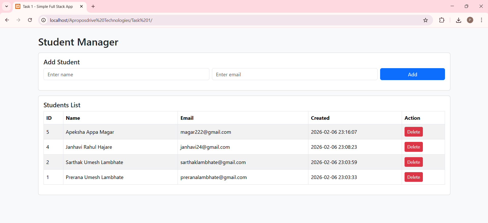

# Task 1 – Simple Full Stack Application  
Frontend + Backend + Database Integration

## Project Overview

This project is a **simple full stack web application** developed as part of **Task 1**.  
It demonstrates how a **frontend application communicates with a backend API**, which in turn **connects successfully to a MySQL database**.

The application allows users to **add, view, and delete student records** using a clean UI and REST-style backend.

## Architecture


## Tech Stack

### Frontend
- HTML5
- Bootstrap 5
- JavaScript (Fetch API)

### Backend
- PHP (REST-style API)

### Database
- MySQL

### Tools
- XAMPP (Apache + MySQL)
- phpMyAdmin
- Web Browser


## Application Features

- Responsive frontend using Bootstrap
- Backend API using PHP
- MySQL database integration
- Add student records
- View all student records
- Delete student records
- JSON-based communication
- Database connection validation

---

## User Interface

The main user interface of the application where users can add and view student records.



---

## Adding Student Successfully

When the user enters a **name and email** and clicks the **Add** button:

1. Fetch API sends a POST request to the backend
2. Backend validates the input
3. Data is stored in the MySQL database
4. Success message is shown on the UI

.png)

---

## Deleting Student Successfully

Each student record includes a **Delete** button.

1. Student ID is sent to backend
2. Record is deleted from database
3. Updated list is shown without page reload

.png)

---

## Database Design

### Database Name : task1_db

### Table Schema
```sql
CREATE TABLE students (
  id INT AUTO_INCREMENT PRIMARY KEY,
  name VARCHAR(100) NOT NULL,
  email VARCHAR(120) NOT NULL UNIQUE,
  created_at TIMESTAMP DEFAULT CURRENT_TIMESTAMP
);
```
.png)
---
