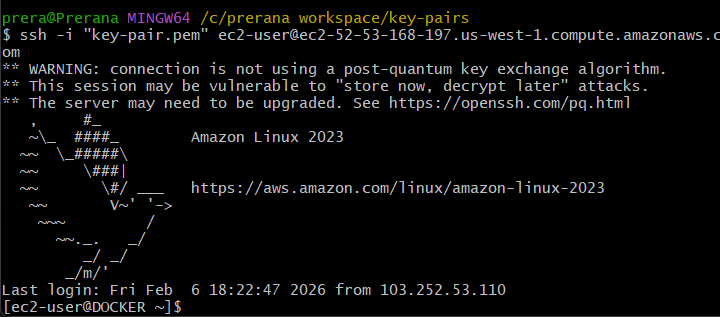
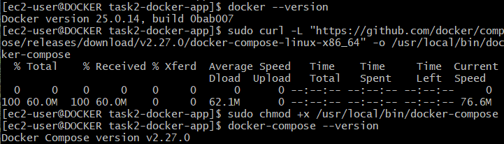
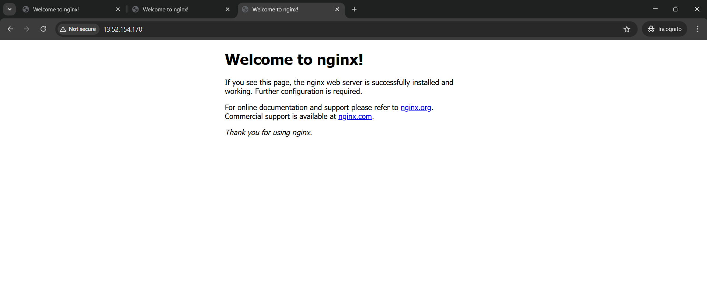
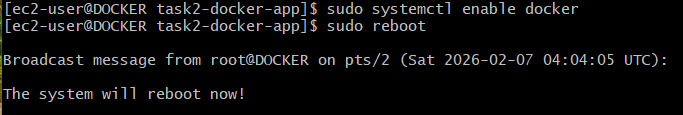

# Task 2 – Docker Deployment on AWS EC2 (Amazon Linux)

## Objective
The objective of this task is to:
- Create Dockerfile(s)
- Run an application using Docker containers
- Expose required ports
- Ensure containers auto-start on EC2 reboot

This task is implemented on an **AWS EC2 instance (Amazon Linux)** using **Docker and Docker Compose**.

## Architecture


## Technologies Used
- AWS EC2 (Amazon Linux)
- Docker
- Docker Compose
- PHP (Backend)
- MySQL (Database)
- Apache Web Server

---


## Step 1: Launch AWS EC2 Instance

- AMI: Amazon Linux 2 / Amazon Linux 2023
- Instance Type: t2.micro
- Security Group Inbound Rules:
  - SSH – Port 22
  - HTTP – Port 80
  - MySQL – Port 3306 (optional, for testing)

Connect to EC2:
```bash
ssh -i key.pem ec2-user@<EC2_PUBLIC_IP>
```


## Step 2: Install Docker on Amazon Linux

Update system :
```bash
sudo yum update -y
```
Install Docker :
```bash
sudo yum install docker -y
```
Start and enable Docker :
```bash
sudo systemctl start docker
sudo systemctl enable docker
```
Add user to Docker group :
```bash
sudo usermod -aG docker ec2-user
newgrp docker
```
Verify installation :
```bash
docker --version
docker ps
```

## Step 3: Install Docker Compose (Manual Method)
Amazon Linux does not support docker-compose-plugin via yum, so Docker Compose is installed manually.

Download Docker Compose :
```bash
sudo curl -L "https://github.com/docker/compose/releases/download/v2.27.0/docker-compose-linux-x86_64" -o /usr/local/bin/docker-compose
```

Verify :
```bash
docker-compose --version

```


## Step 4: Create Project Directory

```bash
mkdir task2-docker-app
cd task2-docker-app
mkdir app
```


## Step 5: Create Application File (PHP)
Create PHP file using vim :
```bash
<?php
$host = getenv("DB_HOST") ?: "db";
$user = getenv("DB_USER") ?: "root";
$pass = getenv("DB_PASS") ?: "rootpass";
$name = getenv("DB_NAME") ?: "studentdb";

$conn = new mysqli($host, $user, $pass, $name);

if ($conn->connect_error) {
    die("Database connection FAILED: " . $conn->connect_error);
}

echo "<h2>Database Connected Successfully!</h2>";
?>
```

## Step 6: Create Dockerfile

```bash
vim Dockerfile
```

```bash
FROM php:8.2-apache
RUN docker-php-ext-install mysqli
COPY app/ /var/www/html/
EXPOSE 80
```

## Step 7: Create docker-compose.yml

```bash
vim docker-compose.yml
```

```bash
version: "3.9"

services:
  web:
    build: .
    container_name: php_web
    ports:
      - "80:80"
    environment:
      DB_HOST: db
      DB_USER: root
      DB_PASS: rootpass
      DB_NAME: studentdb
    depends_on:
      - db
    restart: always

  db:
    image: mysql:8.0
    container_name: mysql_db
    environment:
      MYSQL_ROOT_PASSWORD: rootpass
      MYSQL_DATABASE: studentdb
    volumes:
      - mysql_data:/var/lib/mysql
    restart: always

volumes:
  mysql_data:

```

## Step 8: Build and Run Containers

```bash
docker-compose up -d --build
```

Check running containers :
```bash
docker ps
```

## Step 9: Test Application

From EC2 :
```bash
curl http://localhost
```
From browser :
http://<EC2_PUBLIC_IP>


## Step 10: Auto-start Containers on Reboot

Docker service enabled :
```bash
sudo systemctl enable docker
```

Test :
```bash
sudo reboot
```


After reconnect :
```bash
docker ps
```


## Conclusion

This task successfully demonstrates:

Docker installation on AWS EC2

Dockerfile creation

Multi-container application using Docker Compose

Port exposure

Container auto-start on system reboot