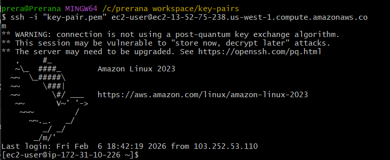
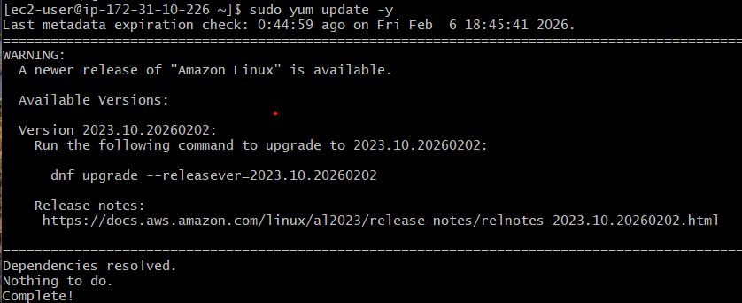
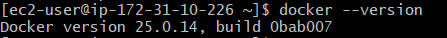
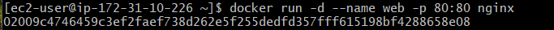
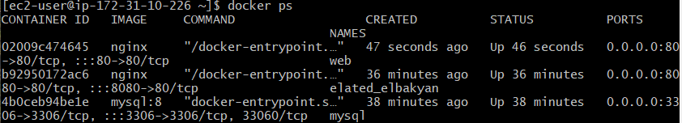
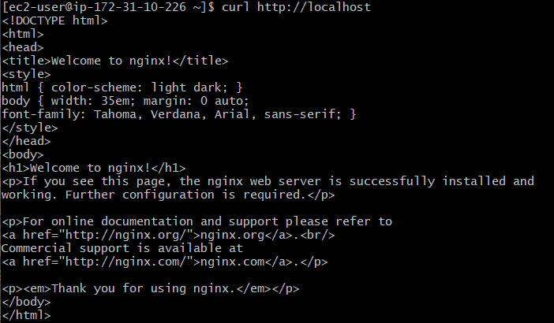
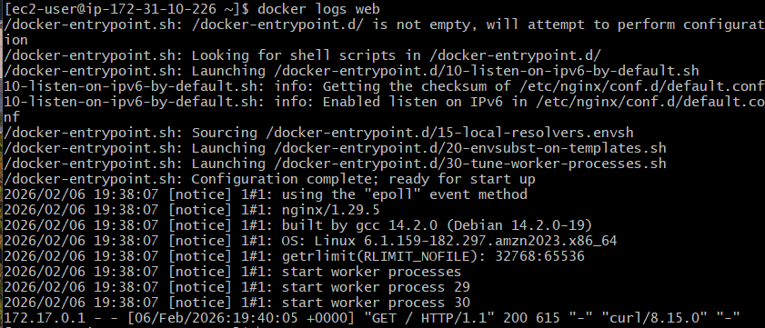
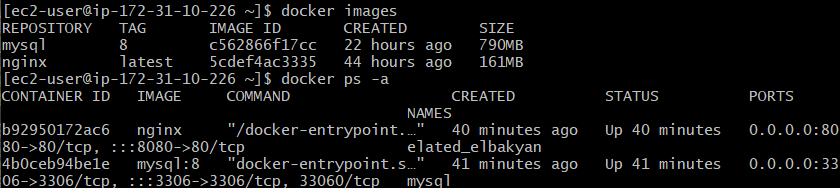

# Task 3: AWS EC2 Deployment using Docker

## Objective
The objective of this task is to deploy and run Docker containers on an AWS EC2 instance using a cost-optimized Amazon Linux server (t2.micro / t3.micro). This task demonstrates successful EC2 setup, Docker installation, and container execution.

## Architecture


## Technologies Used
- **AWS EC2**
- **Amazon Linux**
- **Docker**
- **Nginx** (Docker Container)

---

## EC2 Instance Configuration
- **Operating System:** Amazon Linux
- **Instance Type:** t2.micro (Free Tier Eligible)
- **Architecture:** x86_64
- **Security Group Inbound Rules:**
  - SSH (Port 22) – My IP
  - HTTP (Port 80) – 0.0.0.0/0

---

## Step 1: Launch EC2 Instance
1. Login to AWS Management Console.
2. Navigate to **EC2 → Launch Instance**.
3. Select **Amazon Linux**.
4. Choose instance type **t2.micro / t3.micro**.
5. Configure key pair for SSH access.
6. Configure security group (Ports 22 & 80 open).
7. Launch the instance.

---

## Step 2: Connect to EC2 Instance
```bash
ssh -i "your-key.pem" ec2-user@<EC2_PUBLIC_IP>
```


## Step 3: Update System Packages
```bash
sudo yum update -y
```


## Step 4: Install Docker
```bash
sudo yum install -y docker
```


## Step 5: Start and Enable Docker Service
```bash
sudo systemctl start docker
sudo systemctl enable docker
```


## Step 6: Add User to Docker Group
```bash
sudo usermod -aG docker ec2-user
```

## Step 7: Verify Docker Installation
```bash
docker --version
```


## Step 8: Run Docker Container on EC2
```bash
docker run -d --name web -p 80:80 nginx
```


## Step 9: Verify Running Containers
```bash
docker ps
```


## Step 10: Test Application Inside EC2
```bash
curl http://localhost
```


## Step 11: Access Application from Browser
Access Application from Browser


## Step 12: View Container Logs
```bash
docker logs web
```


## Step 13: Stop and Remove Docker Container
```bash
docker stop web
docker rm web
```

## Step 14: Docker Cleanup
```bash
docker images
docker ps -a
```


---
## Conclusion
This task successfully demonstrates AWS EC2 deployment with Docker. The Dockerized application runs efficiently on Amazon Linux EC2 and is accessible externally, fulfilling all task requirements.