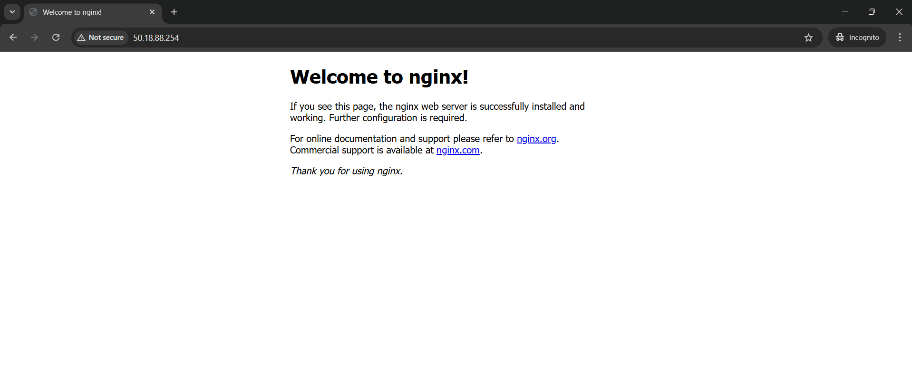
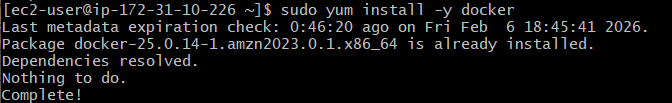
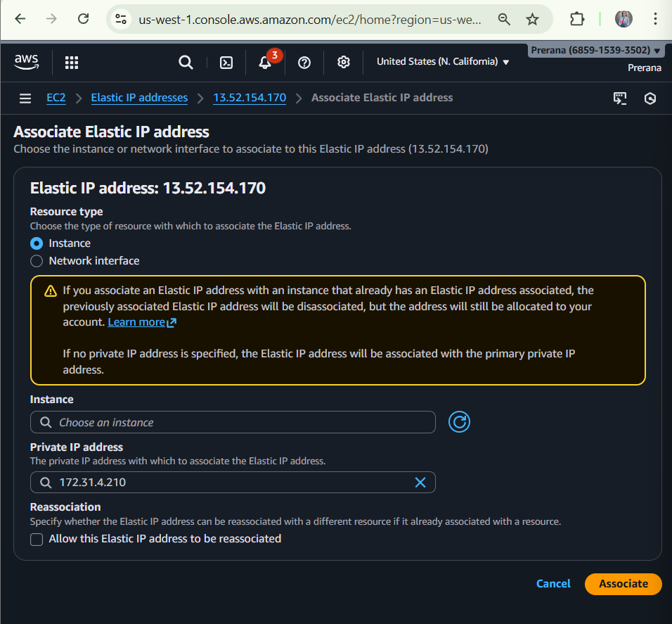
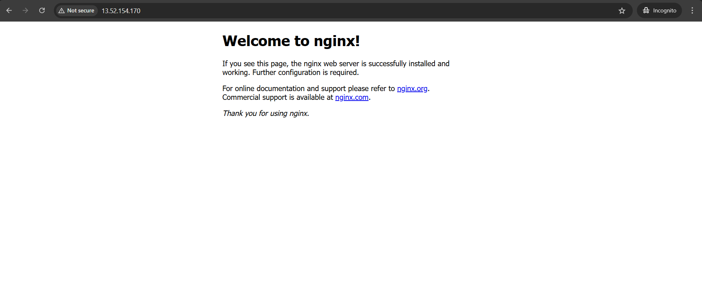

# Task 4 — Application Access (EC2 Public IP / Elastic IP / Route 53)

## Goal
Make the application accessible from a browser using:
- **EC2 Public IP** (temporary)
- **Elastic IP** (static / recommended)
- **Route 53 Domain** (optional: domain → Elastic IP)
## Architecture


## Prerequisites
- AWS Account
- EC2 Key Pair (PEM file)
- App running on EC2 (example: Nginx / Docker container)
- Security Group configured to allow HTTP traffic

---

## Step-by-Step Implementation (Amazon Linux)

## 1) Launch EC2 Instance (Amazon Linux)
1. AWS Console → **EC2** → **Launch instance**
2. Set:
   - **Name**: `task4-app`
   - **AMI**: Amazon Linux 2 / Amazon Linux
   - **Instance Type**: `t2.micro` (free tier)
   - **Key Pair**: select/create `.pem`
3. **Network Settings / Security Group** (Inbound Rules):
   - SSH **22** → My IP
   - HTTP **80** → Anywhere `0.0.0.0/0`
   - HTTPS **443** (optional) → Anywhere `0.0.0.0/0`
4. Launch instance and wait for **Running**

---

## 2) Connect to EC2 (SSH)
From your local machine terminal:

```bash
ssh -i your-key.pem ec2-user@EC2_PUBLIC_IP
```

---

## 3) Install and Run Web Server (Example: Nginx)
Update packages :

```bash
sudo yum update -y
```
Install nginx :
```bash
sudo systemctl start nginx
```
Start nginx :
```bash
sudo systemctl start nginx
```
Enable nginx on reboot :
```bash
sudo systemctl enable nginx
```
Check status :
```bash
systemctl status nginx
```

---

## 4) Access App via EC2 Public IP
1. Copy EC2 Public IPv4 address

2. Open in browser:
http://EC2_PUBLIC_IP


## 5) Allocate & Associate Elastic IP (Static IP)
Allocate EIP
EC2 → Elastic IPs





