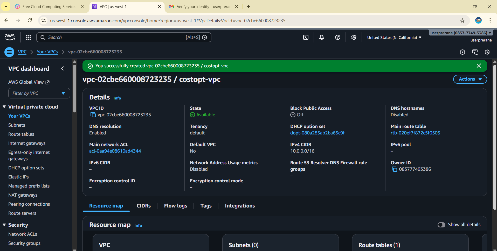
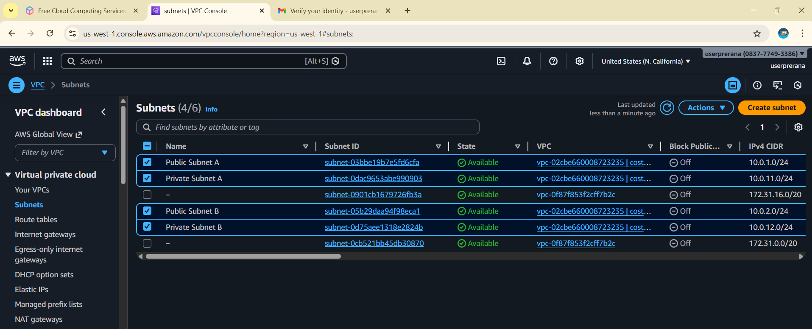
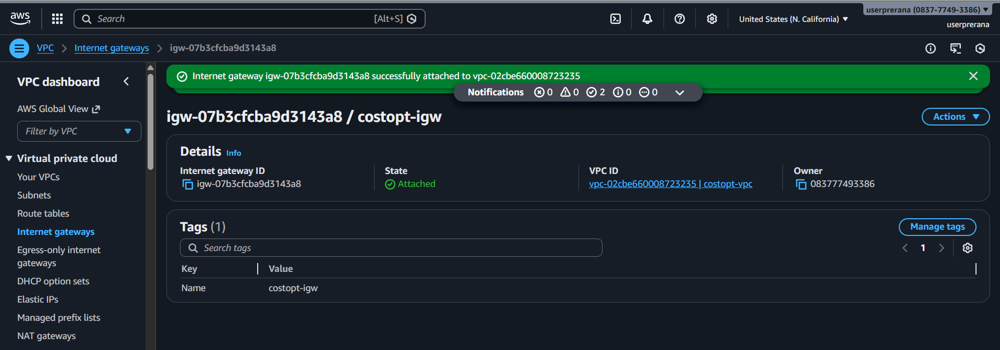
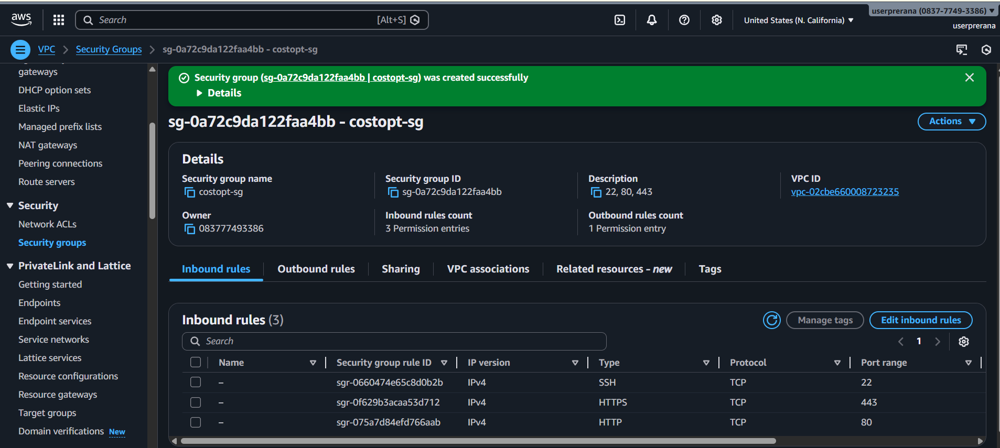
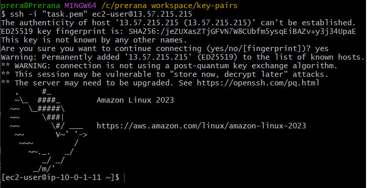
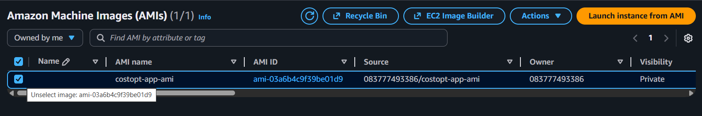
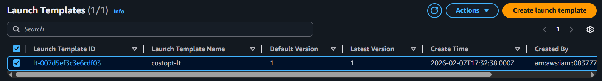
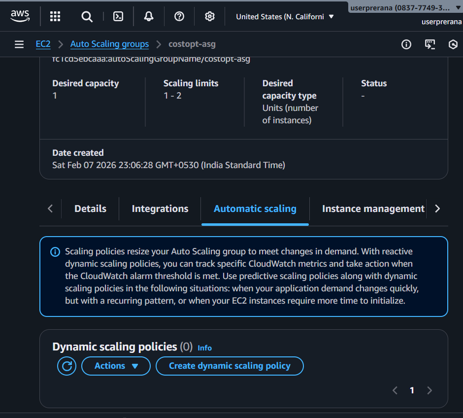

# Task 5: Load Balancer & Auto Scaling (AWS)

## Objective
The objective of this task is to configure an Application Load Balancer (ALB)
and attach it to an Auto Scaling Group (ASG) so that application traffic is
distributed automatically and EC2 instances scale based on CPU utilization.

This setup helps to:
- Distribute traffic evenly
- Improve availability
- Scale resources automatically when load increases

## Architecture

## AWS Region Used
- Region: us-west-1 (N. California)

---

## Step-by-Step Implementation

### Step 1: VPC Setup
A custom VPC was already created and reused for this task.

**Configuration**
- VPC Name: costopt-vpc
- IPv4 CIDR: 10.0.0.0/16

**Screenshot**

---

### Step 2: Subnet Configuration
Two public and two private subnets were created across two Availability Zones.

**Subnets**
- Public Subnet A: 10.0.1.0/24
- Public Subnet B: 10.0.2.0/24
- Private Subnet A: 10.0.11.0/24
- Private Subnet B: 10.0.12.0/24

**Reason**
Public subnets are required for the Application Load Balancer.
Multiple AZs provide high availability.

**Screenshot**

---

### Step 3: Internet Gateway
An Internet Gateway was attached to the VPC to allow internet access
for public subnets and the load balancer.

**Screenshot**

---

### Step 4: Security Group Configuration
A security group was created and reused for application access.

**Inbound Rules**
- SSH (22)
- HTTP (80)
- HTTPS (443)

**Reason**
Only required ports are opened to keep the setup simple and secure.

**Screenshot**

---

### Step 5: EC2 Instance Access
The EC2 instance was launched and accessed successfully using SSH.
This instance is used to create the AMI for Auto Scaling.

**Screenshot**

---

### Step 6: Docker Installation
Docker was installed on the EC2 instance to run the application.

**Screenshot**

---

### Step 7: Create AMI for Auto Scaling
An Amazon Machine Image (AMI) was created from the configured EC2 instance.

**AMI Details**
- AMI Name: costopt-app-ami
- AMI ID: ami-03a6b4c9f39be01d9

**Reason**
This AMI is used by Auto Scaling to launch identical instances.

**Screenshot**

---

### Step 8: Launch Template
A launch template was created using the AMI.

**Configuration**
- Launch Template Name: costopt-lt
- Instance Type: t3.micro
- AMI: costopt-app-ami
- Security Group: costopt-sg
- Key Pair: task

**Reason**
Launch templates ensure consistent EC2 configuration during scaling.

**Screenshot**

---

### Step 9: Auto Scaling Group
An Auto Scaling Group was created using the launch template.

**Configuration**
- Auto Scaling Group Name: costopt-asg
- Minimum Capacity: 1
- Desired Capacity: 1
- Maximum Capacity: 2
- Availability Zones: 2

**Reason**
Keeps one instance running normally and adds another only when required.

**Screenshots**

---

### Step 10: CPU-Based Auto Scaling Policy
A CPU-based target tracking scaling policy was configured.

**Scaling Policy**
- Policy Type: Target tracking
- Metric: Average CPU utilization
- Target Value: 50%
- Cooldown: Default

**Scaling Behavior**
- CPU usage above 50% launches a new instance
- CPU usage below 50% removes extra instances

This prevents unnecessary EC2 instances from running.

---

## Load Balancer & Auto Scaling Summary
- Application Load Balancer distributes traffic
- Auto Scaling Group manages EC2 instances
- Minimum one instance always runs
- Maximum two instances run during high load
- CPU-based scaling avoids over-provisioning
- High availability achieved using multiple AZs

Task 5 is completed successfully.
