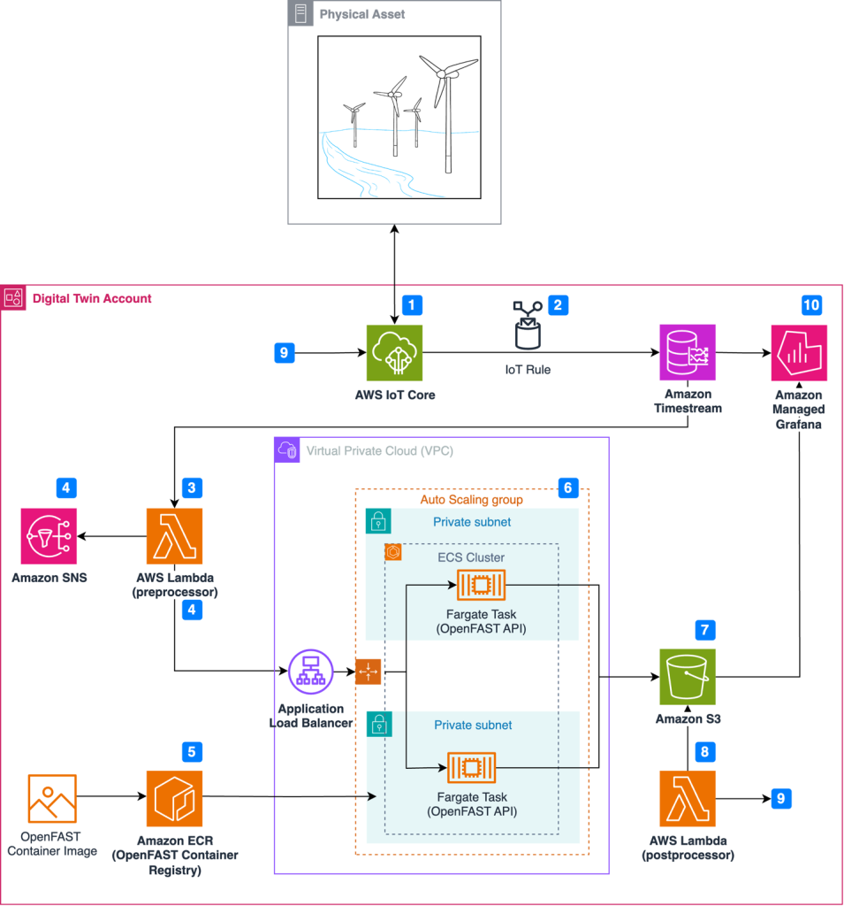

# Task 6: Cost Optimization (AWS)

## Objective
The goal of this task is to create a cost-optimized AWS setup by:
1. Using a low-cost or free-tier eligible EC2 instance.
2. Keeping resources minimal (small storage and limited ports).
3. Using Auto Scaling based on CPU usage to avoid running extra instances.

Scaling logic:
- When CPU usage goes above 50%, a new instance is added.
- When CPU usage goes below 50%, extra instances are removed.

## Architecture

## AWS Region Used
- Region: us-west-1 (N. California)

---

## Step-by-Step Implementation

### Step 1: Create a Custom VPC
A separate VPC was created to keep all resources organized.

**Configuration**
- VPC Name: costopt-vpc
- IPv4 CIDR: 10.0.0.0/16

**Reason**
Using a dedicated VPC helps manage resources properly and avoids unnecessary networking services.

---

### Step 2: Create Subnets
Four subnets were created to follow AWS best practices.

**Subnets**
- Public Subnet A: 10.0.1.0/24
- Public Subnet B: 10.0.2.0/24
- Private Subnet A: 10.0.11.0/24
- Private Subnet B: 10.0.12.0/24

**Reason**
This setup supports high availability and Auto Scaling.  
NAT Gateway was not used to avoid extra cost.

---

### Step 3: Attach Internet Gateway
An Internet Gateway was created and attached to the VPC so that public subnets can access the internet.

**Configuration**
- Internet Gateway Name: costopt-igw
- State: Attached

---

### Step 4: Create Security Group
A security group was created with only required ports.

**Inbound Rules**
- SSH (22) – for server access
- HTTP (80) – for web traffic
- HTTPS (443) – optional secure access

**Reason**
Opening only required ports improves security and avoids unnecessary exposure.

---

### Step 5: Launch EC2 and Verify Access
An EC2 instance was launched and accessed successfully using SSH.

**Reason**
Only a single instance is used initially to reduce cost.

---

### Step 6: Install Docker
Docker was installed on the EC2 instance and verified.

**Reason**
Containers use system resources efficiently and are suitable for cost-optimized deployments.

---

### Step 7: Create AMI
An AMI was created from the configured EC2 instance.

**Configuration**
- AMI Name: costopt-app-ami
- AMI ID: ami-03a6b4c9f39be01d9

**Reason**
This AMI is used by Auto Scaling to launch new instances automatically.

---

### Step 8: Create Launch Template
A launch template was created using the AMI.

**Configuration**
- Launch Template Name: costopt-lt
- Instance Type: t3.micro
- AMI: costopt-app-ami
- Security Group: costopt-sg
- Key Pair: task

**Reason**
Launch templates ensure all Auto Scaling instances use the same configuration.

---

### Step 9: Create Auto Scaling Group
An Auto Scaling Group was created using the launch template.

**Configuration**
- Auto Scaling Group Name: costopt-asg
- Minimum Capacity: 1
- Desired Capacity: 1
- Maximum Capacity: 2
- Availability Zones: 2

**Reason**
Only one instance runs normally. A second instance is added only when required.

---

### Step 10: Add CPU-Based Scaling Policy
A target tracking scaling policy was added based on CPU utilization.

**Scaling Policy Details**
- Policy Type: Target tracking
- Metric: Average CPU utilization
- Target Value: 50%
- Cooldown: Default

**Scaling Behavior**
- CPU > 50% → New instance is launched
- CPU < 50% → Extra instance is terminated

**Screenshot Required**
Add screenshot showing the scaling policy:
- Auto Scaling Group → Automatic scaling → Dynamic scaling policies

---

## Cost Optimization Summary
- Instance Type: t3.micro (low-cost)
- Storage: Default minimal EBS
- Security Group: Only required ports
- Auto Scaling:
  - Min: 1 instance
  - Max: 2 instances
  - CPU-based scaling prevents unnecessary resource usage
